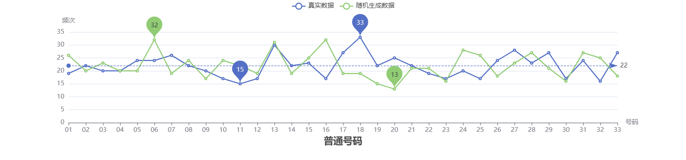
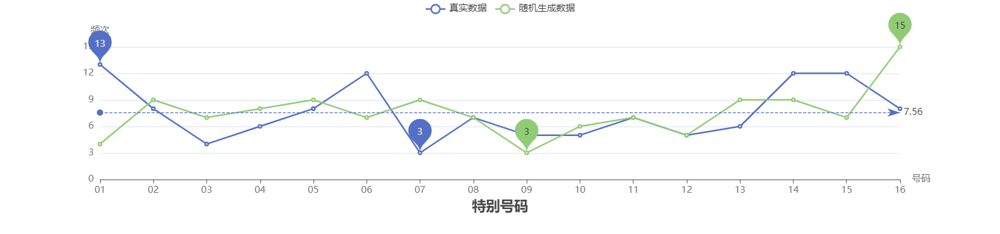

# lottery-data  

统计双色球和大乐透各号码的分布。  
一开始觉得号码分布太不均匀，肯定有假😡后来生成相同数据量的随机数据进行对比，咦，真实数据的分布居然看起来合理了😲





## 启动项目

### 安装依赖

```bash
cd server && yarn install
cd frontend && yarn install
cd llm-prediction && uv sync
```

### 启动服务

三个服务需分别启动：

```bash
cd llm-prediction && uv run server.py  # port 5006, 启动后自动训练模型
cd server && yarn dev                  # port 5005, 通过 SSE 监听 llm-prediction
cd frontend && yarn dev                # port 8080
```

**启动顺序**：llm-prediction 优先，server 会自动以 2s 间隔重试连接 llm-prediction，直到连接成功。首次启动 llm-prediction 会从零训练模型（较慢），后续为增量训练。

### 服务间通信

- **llm-prediction → server**：llm-prediction 通过 SSE（`/api/events`）推送训练状态变更，server 生成唯一 observerId 防止重复监听
- **server → frontend**：server 通过 SSE（`/api/predictionSSE`）转发状态变更给前端
- **server → llm-prediction**：server 通过 HTTP 调用 llm-prediction 的 REST API（预测、触发训练等）
- llm-prediction 可独立运行，不依赖 server